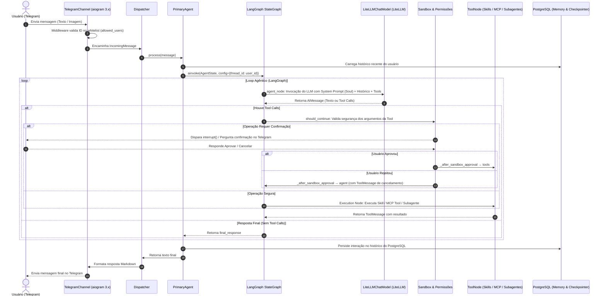

# Arquitetura do Agent Harness

Este documento descreve detalhadamente a arquitetura do **Agent Harness**, desde o momento em que o usuário envia uma mensagem via Telegram até o processamento pelo grafo de estado agêntico do **LangGraph** e o envio da resposta final.

---

## 📐 Visão Geral do Fluxo de Execução

---

## 🔍 Detalhamento dos Componentes

### 1. Camada de Entrada e Validação (`harness/channels/telegram.py`)
- **Recebimento de Mensagens**: O `TelegramChannel` escuta eventos do Telegram usando `aiogram 3.x`.
- **Suporte Multimodal**: Processa imagens anexadas codificando-as em `image_url` no formato padrão aceito pelos modelos de visão.
- **Middleware de Autenticação**: Valida se o `user_id` do remetente está cadastrado na tabela de usuários permitidos (`allowed_users`).

### 2. Camada de Despacho e Resiliência (`harness/core/dispatcher.py`)
- O `Dispatcher` atua como barreira de controle contra falhas:
  - Aplica timeouts configuráveis para evitar travamento de requisições.
  - Captura exceções não tratadas e devolve mensagens amigáveis ao usuário final.

### 3. Orquestração e Grafo de Estado (`harness/agents/`)
A inteligência e o loop de raciocínio do sistema são baseados no **LangGraph**:

* **`AgentState` ([`harness/agents/state.py`](file:///Users/admin/Documents/code/agent-harness/harness/agents/state.py))**:
  - Estado fortemente tipado contendo `messages` (com o redutor `add_messages`), `user_id`, `pending_confirmation` e `final_response`.

* **`StateGraph` ([`harness/agents/graph.py`](file:///Users/admin/Documents/code/agent-harness/harness/agents/graph.py))**:
  - **Nó `agent`**: Invocado no início e após cada resposta de ferramenta. Combina a personalidade do **Soul** ([`soul.md`](file:///Users/admin/Documents/code/agent-harness/config/soul.yaml)) com o contexto da conversa e envia ao LLM.
  - **Aresta Condicional `should_continue`**: Verifica se o LLM decidiu chamar uma ferramenta. Se não, encerra o ciclo (`END`). Se sim, verifica se a ação requer confirmação de segurança.
  - **Nó `sandbox_approval`**: Implementa o mecanismo de *Human-in-the-Loop* com `interrupt()` do LangGraph. Caso o comando seja classificado como perigoso (ex: deleção de arquivos/banco), o fluxo pausa até a confirmação do usuário.
  - **Aresta Condicional `_after_sandbox_approval`**: Após a resposta do usuário, rota para `tools` se aprovado ou de volta para `agent` se rejeitado (com mensagem de cancelamento).
  - **Nó `tools`**: Instância de `ToolNode` que executa a ferramenta solicitada.

### 4. Camada de Abstração de Modelos e Ferramentas (`harness/providers/`)
- **`LiteLLMChatModel` ([`harness/providers/chat_model.py`](file:///Users/admin/Documents/code/agent-harness/harness/providers/chat_model.py))**:
  - Adapter Pattern que converte chamadas da interface `BaseChatModel` do LangChain para o `LLMProvider` (LiteLLM), permitindo suporte a Ollama, OpenAI, Anthropic, Gemini, etc.
- **`tools_adapter` ([`harness/agents/tools_adapter.py`](file:///Users/admin/Documents/code/agent-harness/harness/agents/tools_adapter.py))**:
  - Converte **Skills** ([`harness/skills/`](file:///Users/admin/Documents/code/agent-harness/harness/skills/)), ferramentas **MCP** ([`harness/providers/mcp_manager.py`](file:///Users/admin/Documents/code/agent-harness/harness/providers/mcp_manager.py)) e a ferramenta de subagentes ([`harness/agents/factory.py`](file:///Users/admin/Documents/code/agent-harness/harness/agents/factory.py)) em objetos `BaseTool` nativos.

### 5. Execução de Subagentes (`harness/agents/factory.py`)
- Quando uma tarefa é muito complexa, o agente principal pode invocar a tool `spawn_agent`.
- O `AgentFactory` instancia um `SpawnedAgent` com um objetivo restrito e conjunto filtrado de skills. O subagente roda de forma autônoma sob um Grafo LangGraph dedicado e devolve a resposta sintetizada ao agente pai.

### 6. Persistência de Estado (`harness/memory/`)
- **`ConversationRepository`**: Gerencia o histórico de conversas no **PostgreSQL** (`asyncpg`).
- **`Checkpointer` (LangGraph)**: Salva checkpoints do estado do grafo usando o `user_id` como `thread_id`, garantindo recuperação em caso de reinício.

---

## 🛠️ Padrões de Projeto e Boas Práticas

| Princípio | Como é aplicado no projeto |
|-----------|----------------------------|
| **SOLID (SRP)** | Separação estrita entre canais (`telegram.py`), grafo de decisão (`graph.py`), esquema de estado (`state.py`) e conexão com LLM (`chat_model.py`). |
| **SOLID (OCP/LSP)** | Novas *Skills* ou ferramentas *MCP* podem ser registradas sem alterar o código do grafo, pois utilizam a abstração `BaseTool`. |
| **DRY** | Subagentes (`SpawnedAgent`) e o agente primário (`PrimaryAgent`) compartilham a mesma engine de grafo (`build_harness_graph`). |
| **KISS** | Uso dos recursos nativos do LangGraph (`add_messages`, `ToolNode`, `interrupt`) em vez de construir loops manuais ou gerenciadores de estado complexos. |
| **YAGNI** | Reutilização da camada LiteLLM existente sem reescrever provedores de modelo. |
