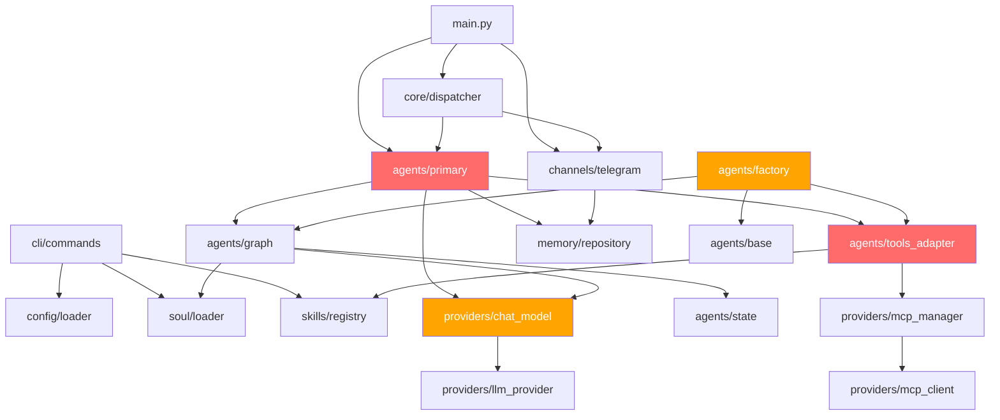

# 🔍 Agent Harness — Relatório de Qualidade de Código

> Análise completa de ~4.500 linhas de código em 40+ arquivos.  
> Classificado por severidade e módulo para priorização em backlog.

---

## Sumário Executivo

| Métrica                     | Valor                   |
| :-------------------------- | :---------------------- |
| Arquivos analisados         | 42                      |
| Linhas de código (fonte)    | ~4.500                  |
| Linhas de teste             | ~1.200                  |
| Bugs críticos               | **2**                   |
| Code smells graves          | **18**                  |
| Duplicação de código        | **8 blocos**            |
| Imports não utilizados      | **6**                   |
| Dead code                   | **3 campos/parâmetros** |
| Missing type hints (graves) | **12**                  |

---

## 🔴 Severidade CRÍTICA (Bugs / Segurança)

### C-1. Event Loop Anti-Pattern em `tools_adapter.py` (BUG)

**Arquivo:** [`tools_adapter.py`](file:///Users/admin/Documents/code/agent-harness/harness/agents/tools_adapter.py#L132-L144)

```python
# LINHAS 136-144: MCP tools NUNCA são carregados em runtime!
loop = asyncio.get_event_loop()
if loop.is_running():
    raw_mcp_tools = loop.run_until_complete(...) if not loop.is_running() else []
    # ↑ CONTRADIÇÃO: se loop.is_running()=True, esta condição é SEMPRE False → raw_mcp_tools = []
```

> [!CAUTION]
> `build_all_langchain_tools()` é chamado dentro de `PrimaryAgent._get_graph()`, que roda dentro de `process()` — um contexto async. O `loop.is_running()` é **sempre True**, fazendo com que **todas as MCP tools sejam silenciosamente descartadas** do grafo de execução.

**Fix:** Tornar `build_all_langchain_tools` uma função `async`:

```diff
-def build_all_langchain_tools(...) -> list[BaseTool]:
+async def build_all_langchain_tools(...) -> list[BaseTool]:
     ...
-    import asyncio
-    try:
-        loop = asyncio.get_event_loop()
-        if loop.is_running():
-            raw_mcp_tools = loop.run_until_complete(...) if not loop.is_running() else []
-        else:
-            raw_mcp_tools = asyncio.run(mcp_manager.list_all_tools())
-    except Exception:
-        raw_mcp_tools = []
+    raw_mcp_tools = await mcp_manager.list_all_tools()
```

Atualizar chamadas em [`primary.py:73`](file:///Users/admin/Documents/code/agent-harness/harness/agents/primary.py#L73) e [`factory.py:80-89`](file:///Users/admin/Documents/code/agent-harness/harness/agents/factory.py#L80-L89).

---

### C-2. `asyncio.run()` crash em `chat_model.py`

**Arquivo:** [`chat_model.py:118`](file:///Users/admin/Documents/code/agent-harness/harness/providers/chat_model.py#L118)

```python
def _generate(self, ...):
    return asyncio.run(self._agenerate(...))  # ← CRASH se loop já ativo
```

> [!CAUTION]
> `asyncio.run()` lança `RuntimeError: asyncio.run() cannot be called from a running event loop` quando usado dentro de LangGraph/aiogram. O método `_generate` deve usar `asyncio.get_event_loop().run_until_complete()` com fallback para thread pool.

---

### C-3. Sandbox bypass por manipulação de string

**Arquivo:** [`sandbox.py:173-200`](file:///Users/admin/Documents/code/agent-harness/harness/core/sandbox.py#L173-L200)

> [!WARNING]
> A verificação de comandos bloqueados usa `blocked_lower in command_lower` (substring matching) com `shell=True`. Atacantes podem bypassar com:
>
> - `r'm' -rf /` (shell quoting)
> - `rm   -rf   /` (extra whitespace)
> - `$(echo rm) -rf /` (command substitution)
>
> **Recomendação:** Usar `shlex.split()` (já importado mas **não usado**) para tokenizar antes de comparar.

---

## 🟠 Severidade ALTA (Code Smells Estruturais)

### H-1. PrimaryAgent é God Class com dual engine

**Arquivo:** [`primary.py`](file:///Users/admin/Documents/code/agent-harness/harness/agents/primary.py)

| Problema                                               | Linhas             |
| :----------------------------------------------------- | :----------------- |
| `process()` tem 74 linhas                              | L92-165            |
| Mantém 2 engines de execução (LangGraph + legacy loop) | L92-165 + L171-211 |
| `_execute_single_tool()` duplica `tools_adapter.py`    | L221-259           |
| Catch-all `Exception` com fallback silencioso          | L146               |

**Refactoring:**

1. Eliminar `_agentic_loop` e `_execute_single_tool` (mover para adaptador de teste)
2. Decompor `process()` em: `_build_user_message()`, `_invoke_graph()`, `_extract_response()`
3. Agrupar dependências em `AgentDependencies` dataclass (6 params no `__init__`)

### H-2. SpawnedAgent não herda BaseAgent

**Arquivo:** [`factory.py:52`](file:///Users/admin/Documents/code/agent-harness/harness/agents/factory.py#L52)

`SpawnedAgent` não implementa `BaseAgent` definido em [`base.py:42`](file:///Users/admin/Documents/code/agent-harness/harness/agents/base.py#L42), quebrando a hierarquia de classes. Além disso, constrói tools manualmente em vez de usar `build_all_langchain_tools()`.

### H-3. TelegramChannel é God Class

**Arquivo:** [`telegram.py`](file:///Users/admin/Documents/code/agent-harness/harness/channels/telegram.py)

Combina: setup de bot, polling lifecycle, dispatch de mensagens, routing de comandos, download/encoding de fotos e tratamento de erros — tudo em uma classe.

**Problemas adicionais:**

- Parse mode inconsistente: Bot usa `ParseMode.MARKDOWN` (L90) mas handlers usam `ParseMode.MARKDOWN_V2` (L153)
- `IncomingMessage` duplicada entre `_handle_message` (L185-195) e `_handle_photo` (L247-259)

### H-4. Duplicação massiva entre `_load_soul_from_yaml` e `_load_soul_from_markdown`

**Arquivo:** [`soul/loader.py`](file:///Users/admin/Documents/code/agent-harness/harness/soul/loader.py#L229-L278)

Ambas funções constroem `Soul(...)` com os mesmos 11 parâmetros e mesmos defaults. **Extrair** `_dict_to_soul(data: dict) -> Soul`.

### H-5. Migrações DB sem transações atômicas

**Arquivo:** [`memory/repository.py`](file:///Users/admin/Documents/code/agent-harness/harness/memory/repository.py)

`run_migrations()` executa SQL e registra versão em operações separadas. Se o registro falhar após executar o SQL, a migração fica em estado inconsistente.

```diff
-await conn.execute(sql)
-log.info("migration_applied", version=version)
+async with conn.transaction():
+    await conn.execute(sql)
+    await conn.execute(
+        "INSERT INTO schema_migrations (version) VALUES ($1)", version
+    )
+log.info("migration_applied", version=version)
```

---

## 🟡 Severidade MÉDIA (Manutenibilidade)

### M-1. Imports não utilizados (6 ocorrências)

| Arquivo                                                                                                      | Import não utilizado    |
| :----------------------------------------------------------------------------------------------------------- | :---------------------- |
| [`chat_model.py:19`](file:///Users/admin/Documents/code/agent-harness/harness/providers/chat_model.py#L19)   | `PrivateAttr`           |
| [`chat_model.py:21`](file:///Users/admin/Documents/code/agent-harness/harness/providers/chat_model.py#L21)   | `ToolCall`              |
| [`mcp_manager.py:23`](file:///Users/admin/Documents/code/agent-harness/harness/providers/mcp_manager.py#L23) | `asyncio`               |
| [`sandbox.py:26`](file:///Users/admin/Documents/code/agent-harness/harness/core/sandbox.py#L26)              | `shlex`                 |
| [`memory/repository.py:7`](file:///Users/admin/Documents/code/agent-harness/harness/memory/repository.py#L7) | `os`                    |
| [`skills/registry.py:204`](file:///Users/admin/Documents/code/agent-harness/harness/skills/registry.py#L204) | `os` (dentro de método) |

### M-2. Dead code / parâmetros não utilizados (3 ocorrências)

| Arquivo                                                                                                      | Campo/Parâmetro             | Detalhe                                                    |
| :----------------------------------------------------------------------------------------------------------- | :-------------------------- | :--------------------------------------------------------- |
| [`dispatcher.py:57`](file:///Users/admin/Documents/code/agent-harness/harness/core/dispatcher.py#L57)        | `self._memory`              | Armazenado mas nunca usado                                 |
| [`mcp_manager.py:42`](file:///Users/admin/Documents/code/agent-harness/harness/providers/mcp_manager.py#L42) | `MCPServerConfig.env`       | Definido, parseado, mas nunca passado a `MCPClient`        |
| [`base.py:85`](file:///Users/admin/Documents/code/agent-harness/harness/skills/base.py#L85)                  | `mcp_tools: list[str] = []` | Mutable class-level default compartilhado entre instâncias |

### M-3. Broad Exception handling (12 ocorrências)

Todos os seguintes locais capturam `Exception` genérica sem re-raise:

| Arquivo            | Linha(s)               |
| :----------------- | :--------------------- |
| `primary.py`       | L146, L250, L256, L287 |
| `factory.py`       | L124                   |
| `tools_adapter.py` | L51, L107, L143        |
| `sandbox.py`       | L261, L301             |
| `telegram.py`      | L129, L241             |

### M-4. Funções longas (>30 linhas) — 14 ocorrências

| Arquivo              | Função                         | Linhas |
| :------------------- | :----------------------------- | :----- |
| `primary.py`         | `process()`                    | 74     |
| `primary.py`         | `_agentic_loop()`              | 42     |
| `primary.py`         | `_execute_single_tool()`       | 40     |
| `factory.py`         | `SpawnedAgent.run()`           | 66     |
| `factory.py`         | `as_tool_definition()`         | 38     |
| `sandbox.py`         | `execute()`                    | 67     |
| `sandbox.py`         | `execute_sync()`               | 38     |
| `sandbox.py`         | `check_command()`              | 34     |
| `telegram.py`        | `_handle_photo()`              | 57     |
| `chat_model.py`      | `bind_tools()`                 | 34     |
| `chat_model.py`      | `langchain_messages_to_dict()` | 33     |
| `llm_provider.py`    | `complete()`                   | 63     |
| `skills/registry.py` | `load_external_skills()`       | 60     |
| `skills/registry.py` | `_load_skills_from_file()`     | 45     |

### M-5. Magic strings/numbers espalhados

- Defaults duplicados: `"Harness"`, `"1.0"`, `"professional"`, `"pt-BR"`, `"Direct and helpful."` em [`loader.py:244-254`](file:///Users/admin/Documents/code/agent-harness/harness/soul/loader.py#L244-L254) e [`loader.py:266-278`](file:///Users/admin/Documents/code/agent-harness/harness/soul/loader.py#L266-L278)
- Node names `"agent"`, `"tools"`, `"sandbox_approval"` repetidos em [`graph.py`](file:///Users/admin/Documents/code/agent-harness/harness/agents/graph.py)
- `MAX_TOOL_ITERATIONS = 15` em `primary.py` e `MAX_GRAPH_STEPS = 15` em `graph.py` — duplicação de propósito
- History limit `20` hardcoded em [`primary.py:99`](file:///Users/admin/Documents/code/agent-harness/harness/agents/primary.py#L99)

### M-6. `__init__.py` modules sem exports

| Módulo                          | Estado |
| :------------------------------ | :----- |
| `harness/agents/__init__.py`    | Vazio  |
| `harness/core/__init__.py`      | Vazio  |
| `harness/channels/__init__.py`  | Vazio  |
| `harness/memory/__init__.py`    | Vazio  |
| `harness/providers/__init__.py` | Vazio  |

### M-7. Duplicação de RPCs em MCPManager

**Arquivo:** [`mcp_manager.py`](file:///Users/admin/Documents/code/agent-harness/harness/providers/mcp_manager.py)

`connect_all()` → `_build_tool_routing()` chama `client.list_tools()` para cada servidor. Depois, `list_all_tools()` chama `client.list_tools()` **novamente**. São 2x network roundtrips na inicialização.

### M-8. `sys.path` mutation sem cleanup

**Arquivo:** [`skills/registry.py:228`](file:///Users/admin/Documents/code/agent-harness/harness/skills/registry.py#L228)

`load_external_skills` insere diretórios em `sys.path` mas nunca os remove, contaminando o path global.

---

## 🔵 Severidade BAIXA (Melhorias de Qualidade)

### L-1. Missing type hints significativos

| Arquivo                | Campo/Retorno                       | Fix                                          |
| :--------------------- | :---------------------------------- | :------------------------------------------- |
| `chat_model.py:67`     | `provider: Any`                     | `provider: LLMProvider`                      |
| `primary.py:60`        | `self._factory: Any`                | `self._factory: AgentFactory \| None`        |
| `primary.py:70`        | `_get_graph() -> Any`               | Retornar `CompiledStateGraph`                |
| `graph.py:27`          | `create_agent_node` sem return type | `-> Callable[[AgentState], Awaitable[dict]]` |
| `graph.py:106`         | `build_harness_graph -> Any`        | `-> CompiledStateGraph`                      |
| `tools_adapter.py:101` | `factory: Any`                      | Protocol ou TYPE_CHECKING import             |

### L-2. Inconsistência de typing style

Mistura de `typing.List`, `typing.Optional` (Python 3.8) com `list`, `| None` (Python 3.10+). Padronizar para 3.10+ em todo o projeto.

### L-3. `BaseSkill.mcp_tools` é mutable class-level default

```diff
-mcp_tools: list[str] = []
+mcp_tools: tuple[str, ...] = ()
```

### L-4. Fire-and-forget task sem referência em `dispatcher.py`

**Arquivo:** [`dispatcher.py:75`](file:///Users/admin/Documents/code/agent-harness/harness/core/dispatcher.py#L75)

```python
asyncio.create_task(self._channel.send_typing(message.user_id))
# Task pode ser garbage collected em Python 3.11+
```

Manter referência: `self._background_tasks.add(task); task.add_done_callback(self._background_tasks.discard)`.

### L-5. `LLMProvider.complete()` pode crash com `IndexError`

**Arquivo:** [`llm_provider.py:152`](file:///Users/admin/Documents/code/agent-harness/harness/providers/llm_provider.py#L152)

```python
choice = raw.choices[0]  # IndexError se choices vazio
```

Adicionar guard: `if not raw.choices: raise LLMProviderError("No choices")`.

---

## 📋 Qualidade dos Testes

### Cobertura Geral

| Módulo                      | Tem testes?  | Cobertura estimada |
| :-------------------------- | :----------- | :----------------- |
| `agents/primary.py`         | ✅           | ~70%               |
| `agents/graph.py`           | ✅           | ~60%               |
| `agents/factory.py`         | ❌           | 0%                 |
| `agents/tools_adapter.py`   | ✅ (parcial) | ~40%               |
| `agents/base.py`            | ❌           | 0%                 |
| `core/dispatcher.py`        | ❌           | 0%                 |
| `core/sandbox.py`           | ✅           | ~80%               |
| `channels/telegram.py`      | ✅           | ~50%               |
| `providers/llm_provider.py` | ✅           | ~85%               |
| `providers/chat_model.py`   | ✅ (parcial) | ~40%               |
| `providers/mcp_client.py`   | ✅           | ~60%               |
| `providers/mcp_manager.py`  | ❌           | 0%                 |
| `skills/registry.py`        | ✅           | ~70%               |
| `soul/loader.py`            | ✅           | ~75%               |
| `memory/repository.py`      | ✅           | ~80%               |
| `config/loader.py`          | ✅ (via CLI) | ~60%               |

### Problemas nos Testes

1. **Fixtures duplicadas** entre `test_primary_agent.py`, `test_langgraph_agent.py` e `test_skills.py` (`mock_soul`, `mock_llm`, `TestSkill/SampleSkill`)
2. **Dados de config duplicados** em `test_new_cli.py` (JSON de 15 linhas copiado 2x)
3. **Zero testes para**: `AgentFactory`, `Dispatcher`, `MCPManager`, `BaseAgent`
4. **MCPClient tests** só cobrem path quando `_session=None` — nenhum teste com session mockada
5. **Assertions fracas**: `assert "X" in result or "Y" in result` em vários testes

### Refactoring de Testes Recomendado

```
tests/conftest.py                ← Fixtures compartilhadas
├── mock_soul()
├── mock_llm()
├── mock_memory()
├── incoming_message()
└── sample_skill_class
```

---

## 📊 Plano de Ação Priorizado

### Sprint 1 — Crítico (1-2 dias)

| #   | Ação                                    | Arquivo(s)                       | Impacto                             |
| :-- | :-------------------------------------- | :------------------------------- | :---------------------------------- |
| 1   | Fix `build_all_langchain_tools` → async | `tools_adapter.py`, `primary.py` | MCP tools não funcionam em produção |
| 2   | Fix `_generate` event loop crash        | `chat_model.py`                  | Crash em sync contexts              |
| 3   | Usar `shlex.split()` no Sandbox         | `sandbox.py`                     | Vulnerabilidade de bypass           |

### Sprint 2 — Estrutural (3-5 dias)

| #   | Ação                                                                 | Arquivo(s)             | Impacto                                 |
| :-- | :------------------------------------------------------------------- | :--------------------- | :-------------------------------------- |
| 4   | Eliminar legacy loop de `PrimaryAgent`                               | `primary.py`           | Elimina 100+ linhas de código duplicado |
| 5   | `SpawnedAgent` herdar `BaseAgent` e usar `build_all_langchain_tools` | `factory.py`           | Consistência arquitetural               |
| 6   | Consolidar Soul loaders em `_dict_to_soul()`                         | `soul/loader.py`       | Elimina duplicação                      |
| 7   | Transações atômicas em migrações                                     | `memory/repository.py` | Integridade de dados                    |
| 8   | Harmonizar parse mode do Telegram                                    | `telegram.py`          | Fix rendering bugs                      |
| 9   | Extrair `IncomingMessage` factory helper                             | `telegram.py`          | DRY                                     |

### Sprint 3 — Qualidade (3-5 dias)

| #   | Ação                                               | Arquivo(s)                                   | Impacto                |
| :-- | :------------------------------------------------- | :------------------------------------------- | :--------------------- |
| 10  | Remover 6 imports não utilizados                   | Vários                                       | SonarQube clean        |
| 11  | Remover dead code (3 campos)                       | `dispatcher.py`, `mcp_manager.py`, `base.py` | SonarQube clean        |
| 12  | Adicionar `__init__.py` exports em 5 módulos       | Vários                                       | API limpa              |
| 13  | Extrair constantes de node names em `graph.py`     | `graph.py`                                   | Evita typos            |
| 14  | Unificar `MAX_TOOL_ITERATIONS` / `MAX_GRAPH_STEPS` | `primary.py`, `graph.py`                     | Single source of truth |
| 15  | Decompor funções >30 linhas (14 ocorrências)       | Vários                                       | Complexidade cognitiva |

### Sprint 4 — Testes (2-3 dias)

| #   | Ação                                                   | Arquivo(s)                      | Impacto                |
| :-- | :----------------------------------------------------- | :------------------------------ | :--------------------- |
| 16  | Criar `conftest.py` com fixtures compartilhadas        | `tests/conftest.py`             | Elimina duplicação     |
| 17  | Testes para `AgentFactory`, `Dispatcher`, `MCPManager` | `tests/`                        | Cobertura de 0% → ~70% |
| 18  | Teste com MCP session mockada                          | `tests/test_mcp_client.py`      | Cobertura real         |
| 19  | Parametrizar `test_should_continue`                    | `tests/test_langgraph_agent.py` | Melhor isolamento      |

---

## Diagrama de Dependências (Módulos)



> [!NOTE]
> Nós em 🔴 vermelho = bugs críticos identificados. Nós em 🟠 laranja = code smells estruturais.
